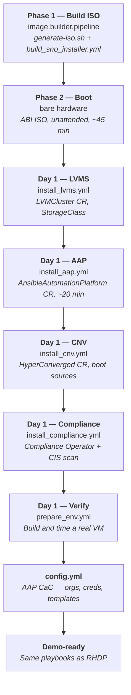

# Architecture — Edge / Single Node OpenShift

Reference for the presenter. What this repo builds on top of a freshly installed
SNO cluster, and how the pieces connect.

For the full architecture — ISO build, Day 0 manifests, storage layout, timing
tables, DNS setup, and hardware minimums — see the
[published guide](https://ericcames.github.io/sales.demos-docs/demos/edge-sno/architecture/).

For **why** it is built this way — the storage race condition, the partition
fix, the CIS approach — read
[`image.builder.pipeline/docs/design.md` section 11](https://github.com/ericcames/image.builder.pipeline/blob/main/docs/design.md#11-sno-installer-kit--agent-based-installer-iso).

---

## The flow

LVMS must come before AAP because the AAP operator needs PVCs for its database
and Hub file storage. AAP must come before CNV because `config.yml` configures
both, and it needs the AAP gateway to be reachable. `config.yml` is not in
`setup_edge.yml` because it needs the admin password, which only exists after
AAP deploys and the user updates the vault.

---

## What this repo creates (Day 1)

| Resource | Playbook | Purpose |
|---|---|---|
| `LVMCluster` CR | `install_lvms.yml` | Thin-provisioned VolumeGroup from partition 5, StorageClass `lvms-vg1` |
| `AnsibleAutomationPlatform` CR | `install_aap.yml` | Gateway, Controller, Hub, EDA, PostgreSQL |
| `HyperConverged` CR | `install_cnv.yml` | CNV with `lvms-vg1` scratch space |
| `ScanSettingBinding` | `install_compliance.yml` | CIS L1 compliance scan |
| AAP objects | `config.yml` | Orgs, credentials, projects, job templates, inventories, schedules |

---

## Timing

Measured on a NUC (12 CPU, 64 GB RAM, SATA SSD), 2026-09-09:

| Phase | Time | Notes |
|---|---|---|
| ISO generation | ~2 min | Downloads `openshift-install` binary |
| Cluster install | ~45 min | Unattended; varies with hardware and network |
| LVMS install | ~2 min | Operator + LVMCluster CR |
| AAP deployment | ~20 min | All five components (gateway, controller, hub, eda, postgres) |
| CNV install | ~4 min | Operator + HyperConverged CR + rhel9 boot source import |
| Compliance Operator | ~2 min | Operator install only; scan runs in background |
| `config.yml` | ~3 min | AAP objects via CaC |
| **Total to demo-ready** | **~80 min** | ~35 min hands-on, ~45 min unattended |

---

## What does not work yet

- **`install_aap.yml` is not automated** — tracked in
  [#395](https://github.com/ericcames/sales.demos/issues/395). Manual CR
  creation documented in the
  [published guide](https://ericcames.github.io/sales.demos-docs/demos/edge-sno/architecture/#manual-aap-deployment).
- **Operator channel selection** — the Day 0 manifests hardcode channels
  (`stable-2.7`, `stable-4.22`). Tracked in
  [image.builder.pipeline#107](https://github.com/ericcames/image.builder.pipeline/issues/107)
  and [#108](https://github.com/ericcames/image.builder.pipeline/issues/108).
- **CIS L1 MachineConfigs** — the Day 0 CIS manifests are placeholders. Tracked
  in [image.builder.pipeline#110](https://github.com/ericcames/image.builder.pipeline/issues/110).

---

## Cleanup

| Destroyed by teardown | Preserved |
|---|---|
| Demo VMs and their PVCs | OpenShift Virtualization |
| AAP inventory hosts for destroyed VMs | AAP itself, all job templates |
| Terraform state for destroyed VMs | Terraform state namespace |
| | LVMS StorageClass |
| | Boot source DataSources |
| | Compliance Operator and scan results |
